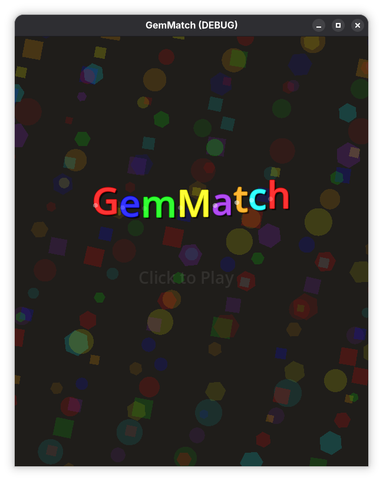
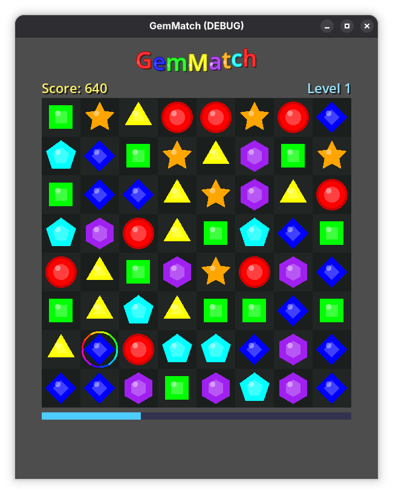
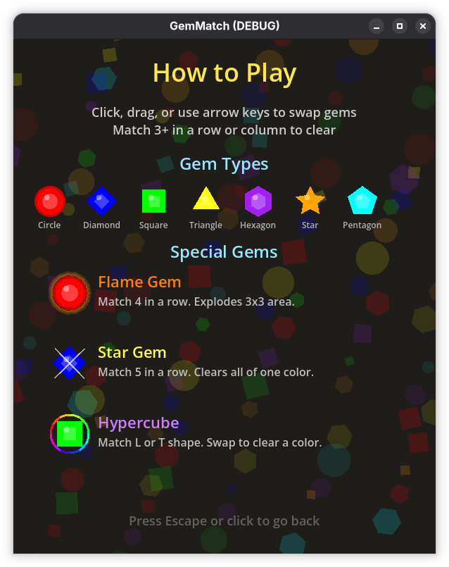

# GemMatch

A Bejeweled-style match-3 puzzle game built entirely with the Godot 4.x engine. No external assets — all graphics are procedurally drawn, all sound effects are synthesized at runtime, and the background music is generated from code.

  





## How to Play

- **Click** a gem to select it, then **click** an adjacent gem to swap
- **Drag** from one gem to an adjacent gem to swap
- **Arrow keys** (or WASD) move the cursor; **Enter/Space** selects; arrow keys from a selected gem swap in that direction
- Match **3 or more** identical gems in a row or column to clear them
- Cleared gems award points; chain reactions multiply your score
- Fill the **progress bar** to advance to the next level
- If no moves remain, click or press any key to restart

## Special Gems

| Match | Creates | Effect |
|-------|---------|--------|
| 4 in a row | 🔥 Flame Gem | Explodes in a 3×3 area when matched |
| 5 in a row | ⭐ Star Gem | Destroys all gems of one color when matched |
| L or T shape | 🌈 Hypercube | Swap with any gem to destroy all of that color |

## Features

- 8×8 grid with 7 gem types, each with a **unique shape** (colorblind accessible)
- **Title screen** with menu: New Game, How to Play, High Scores, Demo Mode, Quit
- **Keyboard, mouse, and drag** input — full keyboard navigation on menus and gameplay
- **High scores** — top 10 persisted to disk with rank, level, and date
- **How to Play screen** — showcases all gem shapes and special gem types with descriptions
- **Demo mode** — AI plays optimally as an attract screen; triggers after 15s idle or from menu
- Smooth **tween animations** — bounce swaps, scale-down removal, bounce-landing gravity
- **Screen shake** that intensifies with chain combos
- **Floating score popups** at match locations
- **Combo callouts** — "Good!", "Great!", "Excellent!", "Amazing!", "Incredible!", "UNBELIEVABLE!"
- **Hint system** — after 4 seconds idle, a valid move is highlighted
- **Level progression** with a progress bar
- **Procedural sound effects** — select, swap, bad swap, match (rising pitch per chain), drop, explosion, star, level-up
- **Procedural chiptune music** — pentatonic melody, square-wave bass, sine pad, all generated at startup
- **Animated background** — 5 geometric patterns (circles, lines, diamonds, waves, hexagons) that cycle each level with shifting hue
- **Animated logo** with per-letter color and bounce

## Project Structure

```
GemMatch/
├── project.godot          # Godot project config (600×730, GL Compatibility, autoloads)
├── scenes/
│   ├── title.tscn         # Title screen scene
│   └── main.tscn          # Gameplay scene: Board, Logo, Labels, SFX, Music
├── scripts/
│   ├── board.gd           # Core game logic, rendering, input, animations, demo AI (970 lines)
│   ├── title.gd           # Title screen, menus, how-to-play, high scores display (307 lines)
│   ├── high_scores.gd     # Autoload singleton — persistent top 10 scores (35 lines)
│   ├── sfx.gd             # Procedural sound effect generator (50 lines)
│   ├── music.gd           # Procedural background music generator (79 lines)
│   └── logo.gd            # Animated "GemMatch" title logo (35 lines)
└── .kiro/
    └── specs/              # Design specs (requirements, design, tasks)
```

**Total: ~1,480 lines of GDScript, 0 external assets.**

## Controls

### Title Screen
| Input | Action |
|-------|--------|
| ↑/↓ or W/S | Navigate menu |
| Enter/Space | Select menu item |
| Escape | Back from sub-screen |
| Mouse | Hover and click |

### Gameplay
| Input | Action |
|-------|--------|
| Arrow keys / WASD | Move cursor |
| Enter / Space | Select gem under cursor |
| Arrow key (with gem selected) | Swap in that direction |
| Escape | Deselect |
| Click | Select / swap gem |
| Drag | Swap adjacent gems |

## Running

Requires [Godot 4.2+](https://godotengine.org/download).

```bash
# If Godot is on PATH:
godot --path .

# Or via Flatpak:
flatpak run org.godotengine.Godot --path /path/to/GemMatch
```

## How This Was Made

This game was built entirely through an AI-assisted conversation with **Claude Opus 4.6** (via Kiro CLI) on **February 18–19, 2025**.

### The process

1. **Spec phase** — Claude generated structured requirements, architecture design, and implementation task documents in `.kiro/specs/`
2. **V1 — Basic game** — A minimal working match-3 with `_draw()`-based rendering, click input, match detection, gravity, and scoring
3. **V2 — Animations & sound** — Added tween animations (swap, remove, fall with bounce), screen shake, score popups, procedural sound effects
4. **V3 — Full feature set** — Special gems (Flame/Star/Hypercube), drag-to-swap, hint system, level progression, combo text, particle effects, distinct gem shapes for accessibility
5. **V4 — Polish** — Animated logo, procedural background music, renamed to GemMatch
6. **V5 — Title screen & menus** — Title screen with 5-item menu (New Game, How to Play, High Scores, Demo Mode, Quit), keyboard navigation throughout, persistent high scores, How to Play showcase screen, optimal demo AI, animated level backgrounds, selection ring follows gem during swap animation

The entire codebase — every line of GDScript, the scene files, and the project config — was written by Claude. No code was written or edited by hand.

## License

MIT
